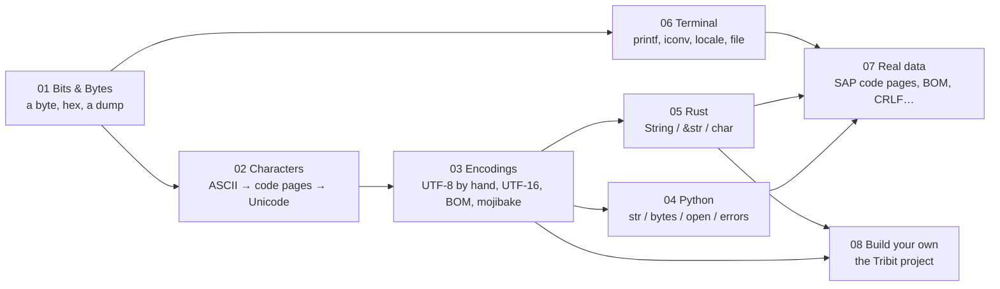

# Start here — the plan

**Level:** reference · the map

**One line:** Seven chapters, read in order, from *what is a byte* to *why is the euro sign wrong in this SAP file* — with four checkpoints along the way that are the four things you said, on day one, that you could not yet do.

## Where you start

Written down on 2026-09-05, so it can be looked back at:

| You said you could not yet… | Which is the subject of | You will be able to after |
|---|---|---|
| Convert `0x41` ↔ 65 ↔ `0b01000001` by hand | [01_Bits_and_Bytes](../01_Bits_and_Bytes/README.md) | chapter 1 (three lessons, all written) |
| Explain code point vs UTF-8 bytes | [02_Characters](../02_Characters/README.md) + [03_Encodings](../03_Encodings/README.md) | [UTF-8 by hand](../03_Encodings/utf8_by_hand/README.md) |
| Explain Python `str` vs `bytes` | [04_Python](../04_Python/README.md) | [Encode, decode and errors](../04_Python/encode_decode_and_errors/README.md) |
| Explain Rust `String` vs `&str` vs `char` | [05_Rust](../05_Rust/README.md) | [`char` is four bytes](../05_Rust/char_is_four_bytes/README.md) |

Those four are the **checkpoints**. Each is a question you can put to yourself with no computer; when the answer comes easily, that chapter is done. The library was built so that the four fall out in that order, because each one needs the one before: you cannot explain UTF-8 bytes without knowing what a byte is, and `String` vs `&str` is not confusing at all once "bytes that promise UTF-8" is a sentence you already believe.

Three tools, all of them: **Python** for the shortest expression of each idea, **the terminal** (`xxd`, `od`, `printf`, `iconv`) for the actual bytes on an actual pipe, and **Rust** for the same idea with the width and the encoding written into the type. Three goals: general fluency, Rust strings, and real SAP data — which is why the last chapter is six interface bugs rather than more theory.

## The order

| Chapter | What it settles | Written / stub |
|---|---|---|
| [01_Bits_and_Bytes](../01_Bits_and_Bytes/README.md) | A byte is 0..255 with no meaning of its own; hex is bits four at a time; a hex dump is three columns | 3 / 0 |
| [02_Characters](../02_Characters/README.md) | A character is a number by agreement — 128, then 256 with everybody's own top half, then one numbering for all | 2 / 3 |
| [03_Encodings](../03_Encodings/README.md) | How a code point becomes bytes: UTF-8 by hand, UTF-16, byte order, and mojibake as the wrong table | 3 / 3 |
| [04_Python](../04_Python/README.md) | `str` vs `bytes`, the `errors` policies, `open()`, normalization, binary formats | 0 / 5 |
| [05_Rust](../05_Rust/README.md) | `String` is bytes that promise UTF-8; `char` is a code point; the three `from_utf8`s; byte slicing | 0 / 4 |
| [06_Terminal](../06_Terminal/README.md) | `printf`, `iconv`, the locale, and why `file` only guesses | 0 / 4 |
| [07_Real_Data](../07_Real_Data/README.md) | SAP code pages, mojibake repair, the BOM in a CSV, byte-width fields, 1252 vs Latin-1, CRLF | 0 / 6 |
| [08_Build_Your_Own](../08_Build_Your_Own/README.md) | A project: the Tribit format — your own code points, a 3-bit variable-length encoding, a container, a viewer — specified with test vectors for a Rust implementation | 1 / 0 |

A **stub** is a page with its questions written down and no example behind it yet; it carries a notice saying so. Stubs exist so the plan has a shape and every page has its permanent address before the prose does. They are written in the order above, and the [ROADMAP](../ROADMAP.md) says which is next.

## How to work a lesson

1. **Read the `One line` and stop.** Try to say why it might be true before reading on.
2. **Run all three examples** from the `Try it` block. The output on the page was produced by exactly those files, so what you see should match to the character; if it does not, that is interesting.
3. **Do the pencil exercise** at the end of `Try it`. Every lesson has one that needs no machine, and it is the part that sticks.
4. **Read the bridge** (*If you are coming from Python or ABAP*). It says what you already know that transfers, and what the new language enforces that the old one left to habit.

One lesson per sitting. The chapters are short on purpose.

## What not to start with

- **Not Rust strings first.** `String` vs `&str` looks like an ownership question and is really an encoding question in disguise. Chapters 1–3 first, and the Rust chapter takes an afternoon.
- **Not normalization before code points.** `'é' == 'é'` being `False` makes no sense until a code point is a number to you.
- **Not the SAP chapter before mojibake.** Every page there is a special case of [Mojibake](../03_Encodings/mojibake/README.md) with a code-page number attached.

## Where C fits

C is the language where a string *is* the bytes: `char` is one byte, `strlen` counts bytes up to the first NUL, and `"café"` is five bytes plus a terminator with nothing in the language that knows about characters. That is the truth Python hides behind `str` and Rust enforces with `&str` versus `&[u8]`, so one look at it in C makes both of the others click. It is not a fourth track here — the pointer arithmetic and `wchar_t` would cost more than they teach — but a short *The C view* section sits on the lessons where it sharpens the point, compiled and checked like every other example. The first is on [Control characters](../02_Characters/control_characters/README.md), where `strlen` stops at a NUL that Python and Rust carry happily; [UTF-8 by hand](../03_Encodings/utf8_by_hand/README.md) will get the second.

## When you want more than the lessons

[RESOURCES.md](../RESOURCES.md) is the outside reading: the one Stack Overflow answer everybody links, the two articles every programmer is told to read, the books, four videos, the tools that let you look a character up, and the katas that ask you to write the real UTF-8 encoder. Every link on it was checked the day it was added.

The project in [08_Build_Your_Own](../08_Build_Your_Own/README.md) can be started any time after chapter 1; its layers 2 and 3 need nothing but bits, and layer 1 is more fun once chapter 2 has explained what a code page is.

## Siblings

This library is built exactly like [rust-learning-library ↗](https://github.com/masiarek/rust-learning-library) and [math-learning-library ↗](https://github.com/masiarek/math-learning-library): one idea per folder, a program behind every claim, and the program's output pasted into the page by a tool rather than a person. Where the Rust library already teaches a thing — `u8`, hexadecimal, `char`, the anatomy of a `String` — the page here links to it and does not repeat it.
