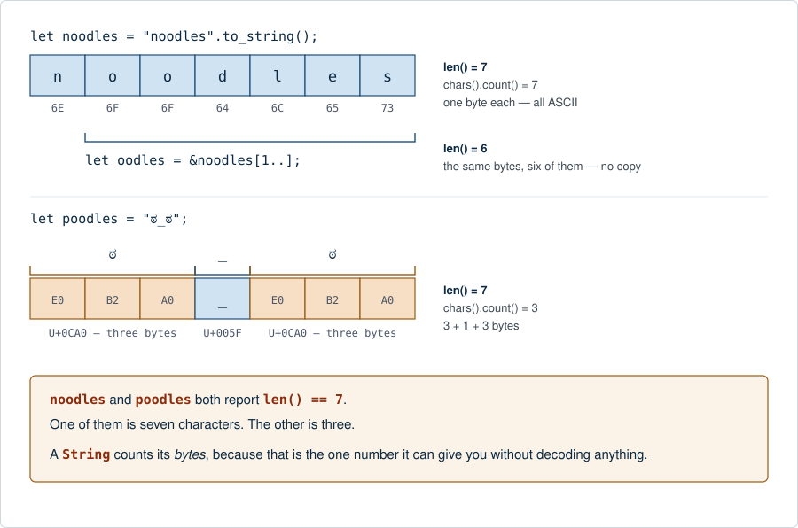

# `String` is bytes that promise UTF-8

**Level:** 101 → 201 · for anyone learning Rust

**One line:** A `String` is a `Vec<u8>` with one extra promise — the bytes are valid UTF-8 — and every strange rule about Rust strings is that promise being kept.



Two of those strings report the same length and mean nothing like the same thing. That is the whole lesson: `len()` is a **byte** count, and it is the only count a `String` can hand you without decoding anything first — which is why [`chars().count()`](../char_is_four_bytes/README.md) is a separate, slower question.

The three variables are the example [*Programming Rust*, 2nd ed. ↗](https://openlibrary.org/isbn/9781492052593) uses to introduce `String`, `&str` and `str`; its own figure draws the *ownership* — stack frame, heap buffer, capacity, who borrows whom. This one is drawn for this library and asks the *encoding* question about the same three lines instead. Read them together: the memory story is [the sibling library's ↗](https://masiarek.github.io/rust-learning-library/14_Strings/anatomy_of_a_string/index.html), and the byte values here are the real UTF-8 encodings — `ಠ` is U+0CA0, `E0 B2 A0`.

## One type, one promise

Strip the promise away and a `String` is a `Vec<u8>`: a growable, heap-allocated run of bytes, with a pointer, a length and a capacity. Everything a `Vec<u8>` can do it can do. The promise is the only thing added, and it is a single sentence — *these bytes are well-formed UTF-8* — but it is what lets `.chars()`, `.to_uppercase()` and `println!("{s}")` exist at all, because each of them would otherwise have to say "…if this is text, which I cannot know."

A promise is only worth something if somewhere it is checked. In Rust there is exactly one door where bytes become a `String`, and it is the one that returns a `Result`:

```rust
String::from_utf8(vec)          // Result<String, FromUtf8Error>   checks, can fail
poodles.as_bytes()              // &[u8]     borrows the bytes, promise still standing
String::from(poodles).into_bytes()  // Vec<u8>   takes the bytes, drops the promise
```

Two of those three cannot fail, because giving a promise *up* costs nothing. Only making one has to be paid for, and `from_utf8` is where you pay.

The four rules that follow are all the same rule:

- **`len()` counts bytes** — the vector counts bytes, and the promise did not change the vector.
- **`s[0]` does not compile** — byte 0 of `"ಠ_ಠ"` is `E0`, which is not a character and never will be.
- **`&s[0..2]` compiles and then panics** — slicing *is* by byte, so the promise has to be re-checked at the cut. That is [Slicing by byte](../slicing_by_byte/README.md).
- **`b"…"` has no `.chars()`** — it is `&[u8; N]`, bytes that nobody promised anything about.

## In Rust

<!-- output:string_is_bytes_that_promise_utf8_rs -->
*Verified output of [`string_is_bytes_that_promise_utf8_rs.rs`](examples/string_is_bytes_that_promise_utf8_rs.rs) — regenerated by `tools/run_examples.py`, never hand-typed.*

```text
1. THREE STRINGS, AND THE TWO COUNTS THAT DISAGREE
   noodles  noodles    len() = 7  bytes    chars().count() = 7 chars
   oodles   oodles     len() = 6  bytes    chars().count() = 6 chars
   poodles  ಠ_ಠ        len() = 7  bytes    chars().count() = 3 chars
   noodles and poodles report the SAME len(). One is 7 characters, the other is 3.

2. len() IS A BYTE COUNT, AND HERE ARE THE BYTES
   noodles  6E 6F 6F 64 6C 65 73
   poodles  E0 B2 A0 5F E0 B2 A0
   'ಠ' is U+0CA0, and UTF-8 spends three bytes on it. 3 + 1 + 3 = 7.

3. THE PROMISE, MADE VISIBLE AS THREE CONVERSIONS
   as_bytes()   -> &[u8]     borrow them:  7 bytes, still promised
   into_bytes() -> Vec<u8>   own them:     7 bytes, promise dropped with the String
   from_utf8()  -> Result    make the promise again — the only direction that can FAIL,
                             because it is the only one that has to CHECK.

4. SO from_utf8 IS WHERE THE PROMISE IS KEPT
   from_utf8(7 bytes) -> Ok("ಠ_ಠ")
   from_utf8(6 bytes) -> Err: incomplete utf-8 byte sequence from index 4
   valid_up_to() = 4  — the first 4 bytes are fine; the cut character is not

5. &str IS TO String WHAT &[u8] IS TO Vec<u8>
   String  owns its bytes and can grow      &str    borrows a run of them
   Vec<u8> owns its bytes and can grow      &[u8]   borrows a run of them
   The difference between the two rows is the promise, and nothing else.
   oodles borrows bytes 1..7 of noodles: "oodles"  (no copy was made)

6. b"..." IS BYTES WITH NO PROMISE, SO IT HAS NO CHARACTERS
   b"noodles" is &[u8; 7]  first byte = 110
   It has .len() and .iter(), but no .chars() — nothing has promised these bytes are text.

7. TWO THINGS THE COMPILER REFUSES, AND WHY
   s[0]        `String` cannot be indexed by a number: byte 0 of 'ಠ_ಠ' is E0, which is not a character.
   &s[0..2]    compiles, then PANICS at run time: byte 2 is inside 'ಠ'. Slicing is by byte, and the
               promise is checked at the cut — see the `Slicing by byte` lesson.
```
<!-- /output -->

Section 4 is the promise being kept in public. Drop one byte off the end and the last `ಠ` is cut in half; `from_utf8` refuses the whole vector and `valid_up_to()` names the exact index where the text stopped being text. That number is not a Rust invention — you will see it again, from Python, in the next section.

## In Python

Python has the same two types and calls them `str` and `bytes`. What it does not have is the promise at rest.

<!-- output:string_is_bytes_that_promise_utf8_py -->
*Verified output of [`string_is_bytes_that_promise_utf8_py.py`](examples/string_is_bytes_that_promise_utf8_py.py) — regenerated by `tools/run_examples.py`, never hand-typed.*

```text
1. PYTHON COUNTS CHARACTERS WHERE RUST COUNTS BYTES
   name      value       len(str)          len(str.encode())
   noodles   noodles      7 characters        7 bytes
   oodles    oodles       6 characters        6 bytes
   poodles   ಠ_ಠ          3 characters        7 bytes
   Rust's String.len() is the RIGHT-hand column. Python's len() is the left one.
   For 'noodles' they agree, which is why the difference stays hidden until it doesn't.

2. THE TWO TYPES, AND THE TWO VERBS BETWEEN THEM
   type(poodles)            = str
   type(poodles.encode())   = bytes
   poodles.encode().hex(' ') = E0 B2 A0 5F E0 B2 A0
   .encode() str -> bytes    .decode() bytes -> str    and neither happens by itself

3. WHERE THE CHECK HAPPENS: NOT AT CONSTRUCTION
   truncated = b'\xe0\xb2\xa0_\xe0\xb2'
   len(truncated) = 6 — Python built this object without complaint.
   A bytes object has made no promise, so it can hold this forever.
   truncated.decode() -> UnicodeDecodeError: unexpected end of data
   start=4 end=6 — the same index Rust's valid_up_to() reports
   Rust puts this check at String::from_utf8. Python puts it at .decode(). Same check, later.

4. errors= IS THE CHOICE from_utf8_lossy MAKES FOR YOU
   truncated.decode(errors='replace') -> 'ಠ_�'
   truncated.decode(errors='ignore') -> 'ಠ_'
   truncated.decode(errors='backslashreplace') -> 'ಠ_\\xe0\\xb2'
   Rust offers exactly one of these in std: from_utf8_lossy, which is errors='replace'.

5. THE ONE PYTHON MAKES EASY THAT RUST REFUSES
   poodles[0] = 'ಠ'   — Python indexes by CHARACTER, so this just works
   Rust will not compile s[0], because byte 0 is E0 and that is not a character.
   Python's answer is friendlier and hides the question; Rust's is ruder and cannot.
```
<!-- /output -->

Section 3 is the difference, in one number. Python builds the truncated `bytes` object without a murmur and will hold it forever; the complaint arrives at `.decode()`, and it arrives with `start=4` — **the same index** Rust's `valid_up_to()` reported. Same check, same answer, different moment. Rust puts it at the point where the bytes claim to be text; Python puts it at the point where you finally ask them to behave like text.

Section 5 is the other half of that trade. `poodles[0]` in Python returns `'ಠ'`, because Python indexes by character. It is friendlier, and it means a Python programmer can work for years without ever meeting the question this page is about.

## In the terminal

<!-- output:string_is_bytes_that_promise_utf8_sh -->
*Verified output of [`string_is_bytes_that_promise_utf8_sh.sh`](examples/string_is_bytes_that_promise_utf8_sh.sh) — regenerated by `tools/run_examples.py`, never hand-typed.*

```text
1. THE SAME TWO STRINGS, WEIGHED BY A PROGRAM THAT HAS NO STRING TYPE
   noodles    7 bytes on the pipe
   ಠ_ಠ    7 bytes on the pipe
   Two different strings, one of them 3 characters long, both 7 bytes.
   Look at the ragged column above: printf '%-10s' pads to ten BYTES, not ten
   characters, so the 3-character string is padded as though it were 7 wide.
   The bug this library is about, biting this script, in its second line of output.

2. AND HERE THEY ARE

$ printf 'noodles' | xxd
00000000: 6e6f 6f64 6c65 73                        noodles

$ printf 'ಠ_ಠ' | xxd
00000000: e0b2 a05f e0b2 a0                        ..._...

   E0 B2 A0 is one character. So is the second E0 B2 A0. The 5F between them is '_'.

3. THE PROMISE, CHECKED BY A TOOL INSTEAD OF A TYPE
   iconv -f UTF-8 -t UTF-8 accepts or rejects; its exit status is the whole answer.
   whole string     -> exit 0, valid UTF-8
   last byte removed -> nonzero exit, NOT valid UTF-8
   That is String::from_utf8 and bytes.decode(), as a process.
```
<!-- /output -->

Nothing in that script knows what a `String` is, and the seven is still seven. The byte count is a property of the text, not of the language holding it — which is the reason this chapter belongs in an encodings library at all.

Section 1's ragged column is the lesson biting the script that teaches it: `printf '%-10s'` pads to ten *bytes*, so a three-character string comes out looking seven wide. Left in on purpose.

## If you are coming from Python or ABAP

**Python.** The mapping is exact and worth memorising: `str` ↔ `String`/`&str`, `bytes` ↔ `Vec<u8>`/`&[u8]`, `.encode()` ↔ `.as_bytes()`/`.into_bytes()`, `.decode()` ↔ `String::from_utf8`. Two real differences, both visible above. Python's `len()` counts characters and Rust's counts bytes, so **every length you port over is a bug until you have checked which one you meant** — `len(s)` becomes `s.chars().count()`, not `s.len()`. And `.decode()` raises where `from_utf8` returns a `Result`, so the failure you could ignore in Python is one the compiler makes you name. Python's `errors='replace'` is Rust's `String::from_utf8_lossy`; the other modes (`ignore`, `backslashreplace`, `surrogateescape`) have no std equivalent, which is a deliberate narrowing rather than an omission.

**ABAP.** ABAP drew this line long before Rust did, and drew it in the type system too: `string` holds characters, `xstring` holds bytes, and they are not assignable to one another. `strlen( )` counts characters where `xstrlen( )` counts bytes — the two counts this whole library is about, already separate keywords. The conversion is `cl_abap_codepage=>convert_to( )` and `convert_from( )`, which is `from_utf8` and `as_bytes` with a class in front; a bad conversion raises `cx_sy_conversion_codepage` rather than returning a value you must unwrap, so it is Python's timing with Rust's typing. The one thing that does *not* transfer: a Unicode ABAP system's `string` is UTF-16 internally, so an ABAP character is not a byte and `xstrlen` on the converted `xstring` is the number to compare against Rust's `len()`. Any specific code-page number should be verified against the system rather than taken from a page. *(Not machine-checked — CI cannot run ABAP.)*

## Try it

```bash
cd 05_Rust/string_is_bytes_that_promise_utf8/examples
rustc --edition 2024 string_is_bytes_that_promise_utf8_rs.rs -o /tmp/sbp && /tmp/sbp
python3 string_is_bytes_that_promise_utf8_py.py
bash string_is_bytes_that_promise_utf8_sh.sh
```

Then change one thing: in the Rust file, replace `"ಠ_ಠ"` with a string of your own — a Polish word, a Russian one, an emoji — and predict `len()` and `chars().count()` before you run it. Encode it by hand first if you have done [UTF-8 by hand](../../03_Encodings/utf8_by_hand/README.md); the templates tell you the byte count without running anything.

## See also

- [`char` is four bytes](../char_is_four_bytes/README.md) — the other count, and why `chars()` is not free
- [From UTF-8, and lossy](../from_utf8_and_lossy/README.md) — the three doors in, and what each promises
- [Slicing by byte](../slicing_by_byte/README.md) — what happens when you cut between `E0` and `B2`
- [Validation is a boundary](../../03_Encodings/validation_is_a_boundary/README.md) — where the check lives, in four languages
- [UTF-8 by hand](../../03_Encodings/utf8_by_hand/README.md) — why `ಠ` costs three bytes
- [The anatomy of a `String` ↗](https://masiarek.github.io/rust-learning-library/14_Strings/anatomy_of_a_string/index.html) — the sibling library's memory story: pointer, length, capacity
