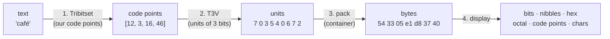

# Tribit — a silly 3-bit encoding, specified

**Level:** 201 → 301 · a project, not a lesson

**One line:** Tribit is a text format built from four things you design yourself — a 64-character set with its own code points, a variable-length encoding of numbers into 3-bit units, a way of packing those units into bytes, and a viewer that shows the result as bits, nibbles, hex, units and characters — and the point of building it is that afterwards *code point*, *code unit*, *byte* and *character* are four words for four things you have held in your hands.

## Why 3 bits, and why silly

A **byte** is 8 bits and a **nibble** is 4; both divide evenly into a byte, so hex never has to think about where one byte ends. A 3-bit unit does not divide into 8. Eight units are 24 bits are three bytes — the same 3:4 relationship base64 has, backwards — and every unit after the second straddles a byte boundary. That is the whole reason for the choice: you cannot implement this by slicing bytes; you have to shift and mask, and `xxd` can no longer show you the structure. One tool can — an **octal** digit is exactly 3 bits — and you will write the viewer that shows it.

Silly is also the point. A format nobody depends on can be wrong, redesigned, and thrown away, and every decision in it is one that UTF-8, UTF-16 and the code pages also had to make. When the spec below says *"a leading unit `100` is overlong and must be refused"*, that is UTF-8's `C0 80` rule, reinvented because you hit the same problem.

## The four layers



Implement them in that order, and keep them in four modules. Layer 1 is a **code page** (a table from characters to *our* numbers). Layer 2 is an **encoding form** (numbers to units) — the part that corresponds to UTF-8. Layer 3 is a **serialization** (units to bytes, plus a header). Layer 4 is the **viewer**. Unicode, UTF-8, and a file on disk are the same four layers; this project just makes each one small enough to see.

### 1. Tribitset — 64 code points we chose

| Range | What | Why there |
|---|---|---|
| 0 | space | the most common character gets the shortest encoding |
| 1–26 | `e t a o i n s h r d l c u m w f g y p b v k j x q z` | English letters in one common frequency order — frequent ones get small numbers |
| 27–36 | `0`–`9` | digits |
| 37–46 | `ą ć ę ł ń ó ś ź ż é` | nine Polish letters, and the `é` of `café` |
| 47 | newline | the one control character |
| 48–60 | `. , ! ? ' - : ; ( ) " € 😀` | thirteen signs; the last two are not one byte in *any* real encoding |
| 61 | **CAPS** | *the next letter is uppercase* — there are no uppercase code points |
| 62 | **RESERVED** | unassigned; an encoder must never produce it, a decoder must refuse it |
| 63 | **ESC** | *the next number is a Unicode scalar value* — the door to every other character |

Three design decisions to notice, because real encodings made the same ones. **Case is not a code point** but a *shift* (61 + letter), which is how the 1930s Baudot teleprinter code did it — and it makes the decoder stateful, which you will feel. **The table is deliberately incomplete** and has an escape hatch, which is how the code pages of the 1980s coexisted with everything they left out. And **frequency drives the numbering**: `e` is one unit, `z` is three, and section 7 of the reference output measures what that buys.

### 2. T3V — a number as units

A **unit** (a *tribit*) is 3 bits, values 0–7, written as one octal digit. To encode a number `n ≥ 0`:

1. Split `n` into 2-bit groups, most significant first, using the fewest groups (`0` is one group).
2. Emit one unit per group: the top bit is **1 if more units follow**, 0 on the last; the low two bits are the group.

So 0–3 is one unit, 4–15 two, 16–63 three, and `U+10FFFF` eleven. `café` under Tribitset is `[12, 3, 16, 46]` → units `70 3 540 672`.

A decoder **must refuse** a sequence that ends with the more-bit set (*truncated*) and a sequence whose first unit is `100` (*overlong* — a leading group of zero adds nothing, so there is exactly one valid spelling of every number). It should check overlong on the **first** unit only: a `100` later in the sequence carries two real zero bits.

T3V is **not self-synchronising** — nothing distinguishes a first unit from a later one, so you cannot start decoding mid-stream. UTF-8 can. Making Tribit able to is the natural version 2 (see *Exercises*).

### 3. Pack — units into bytes, in a container

Concatenate the units' bits, most significant bit first, and cut into bytes; pad the last byte with zero bits. Write:

```text
byte 0–1   the ASCII letters "T3"   (0x54 0x33) — a magic number, so xxd and file can recognise it
byte 2     how many padding bits the last byte carries: 0..7
byte 3…    the payload
```

An empty text is exactly `54 33 00`. A decoder must refuse a wrong magic, a pad count above 7, a pad count with no payload, non-zero pad bits, and a payload whose bit count is not a multiple of 3 after removing the padding.

### 4. Display — the same bytes, six ways

The viewer is a text *viewer*, not an editor: given a `.t3` file, show it as units (octal digits), bits grouped by 3, by 4 (nibbles — watch the seams stop lining up), by 8, hex bytes, the code points, and the characters. The reference prints all of these for every test string, and that block is the viewer's expected output.

## The executable specification

Every table below is a test vector. A Rust implementation is done when it reproduces them.

<!-- output:tribit_reference_py -->
*Verified output of [`tribit_reference_py.py`](examples/tribit_reference_py.py) — regenerated by `tools/run_examples.py`, never hand-typed.*

```text
1. THE TRIBITSET TABLE (our code points)
    0  000000  1 unit   ' '
    1  000001  1 unit   'e'
    2  000010  1 unit   't'
    3  000011  1 unit   'a'
    4  000100  2 units  'o'
    5  000101  2 units  'i'
    6  000110  2 units  'n'
    7  000111  2 units  's'
    8  001000  2 units  'h'
    9  001001  2 units  'r'
   10  001010  2 units  'd'
   11  001011  2 units  'l'
   12  001100  2 units  'c'
   13  001101  2 units  'u'
   14  001110  2 units  'm'
   15  001111  2 units  'w'
   16  010000  3 units  'f'
   17  010001  3 units  'g'
   18  010010  3 units  'y'
   19  010011  3 units  'p'
   20  010100  3 units  'b'
   21  010101  3 units  'v'
   22  010110  3 units  'k'
   23  010111  3 units  'j'
   24  011000  3 units  'x'
   25  011001  3 units  'q'
   26  011010  3 units  'z'
   27  011011  3 units  '0'
   28  011100  3 units  '1'
   29  011101  3 units  '2'
   30  011110  3 units  '3'
   31  011111  3 units  '4'
   32  100000  3 units  '5'
   33  100001  3 units  '6'
   34  100010  3 units  '7'
   35  100011  3 units  '8'
   36  100100  3 units  '9'
   37  100101  3 units  'ą'
   38  100110  3 units  'ć'
   39  100111  3 units  'ę'
   40  101000  3 units  'ł'
   41  101001  3 units  'ń'
   42  101010  3 units  'ó'
   43  101011  3 units  'ś'
   44  101100  3 units  'ź'
   45  101101  3 units  'ż'
   46  101110  3 units  'é'
   47  101111  3 units  '\n'
   48  110000  3 units  '.'
   49  110001  3 units  ','
   50  110010  3 units  '!'
   51  110011  3 units  '?'
   52  110100  3 units  "'"
   53  110101  3 units  '-'
   54  110110  3 units  ':'
   55  110111  3 units  ';'
   56  111000  3 units  '('
   57  111001  3 units  ')'
   58  111010  3 units  '"'
   59  111011  3 units  '€'
   60  111100  3 units  '😀'
   61  111101  3 units  CAPS  (next letter is uppercase)
   62  111110  3 units  RESERVED (an encoder must refuse it)
   63  111111  3 units  ESC   (next number is a Unicode scalar)

2. T3V: ONE NUMBER AS UNITS   (unit = [more][2 bits], top group first)
          0 =      0x0  ->  0           ( 1 unit )  000
          1 =      0x1  ->  1           ( 1 unit )  001
          3 =      0x3  ->  3           ( 1 unit )  011
          4 =      0x4  ->  50          ( 2 units)  101 000
          5 =      0x5  ->  51          ( 2 units)  101 001
         15 =      0xf  ->  73          ( 2 units)  111 011
         16 =     0x10  ->  540         ( 3 units)  101 100 000
         63 =     0x3f  ->  773         ( 3 units)  111 111 011
         64 =     0x40  ->  5440        ( 4 units)  101 100 100 000
        255 =     0xff  ->  7773        ( 4 units)  111 111 111 011
        256 =    0x100  ->  54440       ( 5 units)  101 100 100 100 000
        233 =     0xe9  ->  7661        ( 4 units)  111 110 110 001
       8364 =   0x20ac  ->  6446670     ( 7 units)  110 100 100 110 110 111 000
      65535 =   0xffff  ->  77777773    ( 8 units)  111 111 111 111 111 111 111 011
      65536 =  0x10000  ->  544444440   ( 9 units)  101 100 100 100 100 100 100 100 000
     128512 =  0x1f600  ->  577564440   ( 9 units)  101 111 111 101 110 100 100 100 000
    1114111 = 0x10ffff  ->  54477777773 (11 units)  101 100 100 111 111 111 111 111 111 111 011

3. T3V DECODER REFUSALS
   truncated     [5]  -> truncated T3V at unit 0
   truncated     [5, 6]  -> truncated T3V at unit 0
   overlong 0    [4, 0]  -> overlong T3V at unit 0
   overlong 1    [4, 1]  -> overlong T3V at unit 0
   not a tribit  [8]  -> unit 8 is not a tribit
   (44 0 = 100 100 000 -> 0 is overlong too: the check is on the FIRST unit only,
    because a later 100 carries two real zero bits.)

4. TEXT, END TO END
   text        ''
   code points []
   units (oct)
   bits by 3
   bits by 4      <- nibbles: the seams no longer line up
   bits by 8
   packed      54 33 00   (T3 magic, pad=0, then 0 bytes)
   round trip  True
   payload bytes: Tribit 0   UTF-8 0   UTF-16 0

   text        'e'
   code points [1]
   units (oct) 1
   bits by 3   001
   bits by 4   001   <- nibbles: the seams no longer line up
   bits by 8   001
   packed      54 33 05 20   (T3 magic, pad=5, then 1 bytes)
   round trip  True
   payload bytes: Tribit 1   UTF-8 1   UTF-16 2

   text        'a'
   code points [3]
   units (oct) 3
   bits by 3   011
   bits by 4   011   <- nibbles: the seams no longer line up
   bits by 8   011
   packed      54 33 05 60   (T3 magic, pad=5, then 1 bytes)
   round trip  True
   payload bytes: Tribit 1   UTF-8 1   UTF-16 2

   text        'café'
   code points [12, 3, 16, 46]
   units (oct) 703540672
   bits by 3   111 000 011 101 100 000 110 111 010
   bits by 4   1110 0001 1101 1000 0011 0111 010   <- nibbles: the seams no longer line up
   bits by 8   11100001 11011000 00110111 010
   packed      54 33 05 e1 d8 37 40   (T3 magic, pad=5, then 4 bytes)
   round trip  True
   payload bytes: Tribit 4   UTF-8 5   UTF-16 8

   text        'Hello, World!'
   code points [61, 8, 1, 11, 11, 4, 49, 0, 61, 15, 4, 9, 11, 10, 50]
   units (oct) 77160163635074107717350616362742
   bits by 3   111 111 001 110 000 001 110 011 110 011 101 000 111 100 001 000 111 111 001 111 011 101 000 110 001 110 011 110 010 111 100 010
   bits by 4   1111 1100 1110 0000 0111 0011 1100 1110 1000 1111 0000 1000 1111 1100 1111 0111 0100 0110 0011 1001 1110 0101 1110 0010   <- nibbles: the seams no longer line up
   bits by 8   11111100 11100000 01110011 11001110 10001111 00001000 11111100 11110111 01000110 00111001 11100101 11100010
   packed      54 33 00 fc e0 73 ce 8f 08 fc f7 46 39 e5 e2   (T3 magic, pad=0, then 12 bytes)
   round trip  True
   payload bytes: Tribit 12   UTF-8 13   UTF-16 26

   text        'Zażółć gęślą jaźń'
   code points [61, 26, 3, 45, 42, 40, 38, 0, 17, 39, 43, 11, 37, 0, 23, 3, 44, 41]
   units (oct) 771562367166266065205416536636365105533670661
   bits by 3   111 111 001 101 110 010 011 110 111 001 110 110 010 110 110 000 110 101 010 000 101 100 001 110 101 011 110 110 011 110 011 110 101 001 000 101 101 011 011 110 111 000 110 110 001
   bits by 4   1111 1100 1101 1100 1001 1110 1110 0111 0110 0101 1011 0000 1101 0101 0000 1011 0000 1110 1010 1111 0110 0111 1001 1110 1010 0100 0101 1010 1101 1110 1110 0011 0110 001   <- nibbles: the seams no longer line up
   bits by 8   11111100 11011100 10011110 11100111 01100101 10110000 11010101 00001011 00001110 10101111 01100111 10011110 10100100 01011010 11011110 11100011 0110001
   packed      54 33 01 fc dc 9e e7 65 b0 d5 0b 0e af 67 9e a4 5a de e3 62   (T3 magic, pad=1, then 17 bytes)
   round trip  True
   payload bytes: Tribit 17   UTF-8 26   UTF-16 34

   text        '€'
   code points [59]
   units (oct) 763
   bits by 3   111 110 011
   bits by 4   1111 1001 1   <- nibbles: the seams no longer line up
   bits by 8   11111001 1
   packed      54 33 07 f9 80   (T3 magic, pad=7, then 2 bytes)
   round trip  True
   payload bytes: Tribit 2   UTF-8 3   UTF-16 2

   text        '😀'
   code points [60]
   units (oct) 770
   bits by 3   111 111 000
   bits by 4   1111 1100 0   <- nibbles: the seams no longer line up
   bits by 8   11111100 0
   packed      54 33 07 fc 00   (T3 magic, pad=7, then 2 bytes)
   round trip  True
   payload bytes: Tribit 2   UTF-8 4   UTF-16 4

   text        'é'
   code points [1, 63, 769]
   units (oct) 177374441
   bits by 3   001 111 111 011 111 100 100 100 001
   bits by 4   0011 1111 1011 1111 0010 0100 001   <- nibbles: the seams no longer line up
   bits by 8   00111111 10111111 00100100 001
   packed      54 33 05 3f bf 24 20   (T3 magic, pad=5, then 4 bytes)
   round trip  True
   payload bytes: Tribit 4   UTF-8 3   UTF-16 4

   text        'AB'
   code points [61, 3, 61, 20]
   units (oct) 7713771550
   bits by 3   111 111 001 011 111 111 001 101 101 000
   bits by 4   1111 1100 1011 1111 1100 1101 1010 00   <- nibbles: the seams no longer line up
   bits by 8   11111100 10111111 11001101 101000
   packed      54 33 02 fc bf cd a0   (T3 magic, pad=2, then 4 bytes)
   round trip  True
   payload bytes: Tribit 4   UTF-8 2   UTF-16 4

   text        'ü'
   code points [63, 252]
   units (oct) 7737770
   bits by 3   111 111 011 111 111 111 000
   bits by 4   1111 1101 1111 1111 1100 0   <- nibbles: the seams no longer line up
   bits by 8   11111101 11111111 11000
   packed      54 33 03 fd ff c0   (T3 magic, pad=3, then 3 bytes)
   round trip  True
   payload bytes: Tribit 3   UTF-8 2   UTF-16 2

   text        '\t'
   code points [63, 9]
   units (oct) 77361
   bits by 3   111 111 011 110 001
   bits by 4   1111 1101 1110 001   <- nibbles: the seams no longer line up
   bits by 8   11111101 1110001
   packed      54 33 01 fd e2   (T3 magic, pad=1, then 2 bytes)
   round trip  True
   payload bytes: Tribit 2   UTF-8 1   UTF-16 2

5. UNPACK REFUSALS
   bad magic        58 33 00       -> bad magic b'X3'
   pad > 7          54 33 08 00    -> pad count 8 > 7
   pad, no payload  54 33 02       -> pad count with no payload
   pad bits set     54 33 02 03    -> pad bits are not zero
   bits not /3      54 33 00 00    -> 8 payload bits is not a multiple of 3

6. CODE POINT REFUSALS
   CAPS at end        [61]  -> CAPS at end of text
   CAPS before digit  [61, 27]  -> CAPS before non-letter code point 27
   ESC at end         [63]  -> ESC at end of text
   ESC to surrogate   [63, 55296]  -> ESC to invalid Unicode scalar 0xd800
   ESC past Unicode   [63, 1114112]  -> ESC to invalid Unicode scalar 0x110000
   reserved           [62]  -> reserved code point 62

7. THE SAME TEXT UNDER THREE CODE-POINT ASSIGNMENTS, ONE ENCODING
   Tribit  = T3V over OUR code points;  T3U = T3V over UNICODE code points (no table)
   text                  Tribit   T3U  UTF-8  UTF-16   (payload bytes)
   'e'                        1     2      1       2
   'the'                      2     5      3       6
   'café'                     4     6      5       8
   'Hello, World!'           12    19     13      26
   'Zażółć gęślą jaźń'       17    28     26      34
   '😀'                        2     4      4       4
   Same encoding, different numbering: the table is where the bytes were saved or spent.
```
<!-- /output -->

Read the Python beside the numbers — it is 200 lines, and each layer is one function pair:

<!-- source:tribit_reference_py -->
*[`tribit_reference_py.py`](examples/tribit_reference_py.py) in full — pasted here by `tools/run_examples.py` from the file CI runs.*

```python
#!/usr/bin/env python3
"""Tribit — a deliberately silly 3-bit text encoding, as an executable spec.

Run:  python3 tribit_reference_py.py

This file IS the specification's test oracle. Every table it prints is a test
vector a Rust implementation has to reproduce. Read the page beside it for the
rules in prose; read this for the rules as code.

Four layers, each one thing to implement:

  1. TRIBITSET   our own character set: 64 code points, chosen by us
  2. T3V         a variable-length encoding of a number into 3-bit units
  3. PACK        3-bit units into 8-bit bytes, inside a tiny container
  4. DISPLAY     the same bytes shown as units, bits, nibbles, hex, code points
"""

# --------------------------------------------------------------------------
# 1. TRIBITSET — the code points. A number for every character WE decided on.
# --------------------------------------------------------------------------
# Frequent letters get small numbers on purpose: in T3V, 0..3 cost one unit,
# 4..15 two, 16..63 three. That is the only design idea in this table.
LETTERS = "etaoinshrdlcumwfgypbvkjxqz"          # one common English frequency order
POLISH = "ąćęłńóśźżé"                           # nine Polish letters, and the é of café
PUNCT = ".,!?'-:;()\"€😀"                        # 13 signs; the last two are NOT one byte anywhere

TABLE: dict[int, str] = {0: " "}
TABLE.update({i + 1: c for i, c in enumerate(LETTERS)})         # 1..26
TABLE.update({27 + i: d for i, d in enumerate("0123456789")})   # 27..36
TABLE.update({37 + i: c for i, c in enumerate(POLISH)})         # 37..46
TABLE[47] = "\n"
TABLE.update({48 + i: c for i, c in enumerate(PUNCT)})          # 48..60
CAPS, RESERVED, ESC = 61, 62, 63                                 # three control code points
assert len(TABLE) == 61 and max(TABLE) == 60

CHAR_TO_CP = {c: cp for cp, c in TABLE.items()}


class TribitError(Exception):
    """Every refusal has a name. A Rust port turns these into an enum."""


def text_to_codepoints(text: str) -> list[int]:
    """Text -> Tribitset code points. Uppercase costs a CAPS first; anything
    outside the table costs an ESC followed by its Unicode scalar value."""
    out: list[int] = []
    for ch in text:
        if ch in CHAR_TO_CP:
            out.append(CHAR_TO_CP[ch])
        elif ch.isupper() and ch.lower() in CHAR_TO_CP and ch.lower().isalpha():
            out += [CAPS, CHAR_TO_CP[ch.lower()]]
        else:
            out += [ESC, ord(ch)]          # ord() is a UNICODE code point, up to 0x10FFFF
    return out


def codepoints_to_text(cps: list[int]) -> str:
    out: list[str] = []
    i = 0
    while i < len(cps):
        cp = cps[i]
        if cp == CAPS:
            if i + 1 >= len(cps):
                raise TribitError("CAPS at end of text")
            nxt = cps[i + 1]
            if nxt not in TABLE or not TABLE[nxt].isalpha():
                raise TribitError(f"CAPS before non-letter code point {nxt}")
            out.append(TABLE[nxt].upper())
            i += 2
        elif cp == ESC:
            if i + 1 >= len(cps):
                raise TribitError("ESC at end of text")
            u = cps[i + 1]
            if u > 0x10FFFF or 0xD800 <= u <= 0xDFFF:
                raise TribitError(f"ESC to invalid Unicode scalar {u:#x}")
            out.append(chr(u))
            i += 2
        elif cp == RESERVED:
            raise TribitError("reserved code point 62")
        elif cp in TABLE:
            out.append(TABLE[cp])
            i += 1
        else:
            raise TribitError(f"code point {cp} is not in Tribitset")
    return "".join(out)


# --------------------------------------------------------------------------
# 2. T3V — a number as 3-bit units: [more][2 payload bits], top bits first.
# --------------------------------------------------------------------------
def t3v_encode(n: int) -> list[int]:
    """0..3 -> 1 unit, 4..15 -> 2, 16..63 -> 3, ..., 0x10FFFF -> 11."""
    if n < 0:
        raise TribitError("negative")
    groups = []
    while True:
        groups.append(n & 0b11)
        n >>= 2
        if n == 0:
            break
    groups.reverse()                                   # most significant group first
    return [(0b100 | g) for g in groups[:-1]] + [groups[-1]]


def t3v_decode(units: list[int], at: int = 0) -> tuple[int, int]:
    """Decode one number starting at `at`; return (value, units consumed).
    Refuses a truncated sequence and an overlong one."""
    n, i = 0, at
    while True:
        if i >= len(units):
            raise TribitError(f"truncated T3V at unit {at}")
        u = units[i]
        if not 0 <= u <= 7:
            raise TribitError(f"unit {u} is not a tribit")
        if i == at and (u & 0b11) == 0 and (u & 0b100):
            raise TribitError(f"overlong T3V at unit {at}")   # a leading 100 adds nothing
        n = (n << 2) | (u & 0b11)
        i += 1
        if not (u & 0b100):
            return n, i - at


def units_encode(cps: list[int]) -> list[int]:
    return [u for cp in cps for u in t3v_encode(cp)]


def units_decode(units: list[int]) -> list[int]:
    out, i = [], 0
    while i < len(units):
        n, used = t3v_decode(units, i)
        out.append(n)
        i += used
    return out


# --------------------------------------------------------------------------
# 3. PACK — units into bytes, MSB first, inside a 3-byte-header container.
# --------------------------------------------------------------------------
MAGIC = b"T3"


def pack(units: list[int]) -> bytes:
    bits = "".join(f"{u:03b}" for u in units)
    pad = (-len(bits)) % 8
    bits += "0" * pad
    payload = bytes(int(bits[i : i + 8], 2) for i in range(0, len(bits), 8))
    return MAGIC + bytes([pad]) + payload


def unpack(data: bytes) -> list[int]:
    if data[:2] != MAGIC:
        raise TribitError(f"bad magic {data[:2]!r}")
    if len(data) < 3:
        raise TribitError("no pad byte")
    pad = data[2]
    if pad > 7:
        raise TribitError(f"pad count {pad} > 7")
    bits = "".join(f"{b:08b}" for b in data[3:])
    if pad:
        if not data[3:]:
            raise TribitError("pad count with no payload")
        if bits[-pad:] != "0" * pad:
            raise TribitError("pad bits are not zero")
        bits = bits[:-pad]
    if len(bits) % 3:
        raise TribitError(f"{len(bits)} payload bits is not a multiple of 3")
    return [int(bits[i : i + 3], 2) for i in range(0, len(bits), 3)]


def encode(text: str) -> bytes:
    return pack(units_encode(text_to_codepoints(text)))


def decode(data: bytes) -> str:
    return codepoints_to_text(units_decode(unpack(data)))


# --------------------------------------------------------------------------
# 4. DISPLAY — the same thing, several ways.
# --------------------------------------------------------------------------
def group(bits: str, n: int) -> str:
    return " ".join(bits[i : i + n] for i in range(0, len(bits), n))


def show(text: str) -> None:
    cps = text_to_codepoints(text)
    units = units_encode(cps)
    data = encode(text)
    bits = "".join(f"{u:03b}" for u in units)
    print(f"   text        {text!r}")
    print(f"   code points {cps}")
    print(f"   units (oct) {''.join(str(u) for u in units)}".rstrip())
    print(f"   bits by 3   {group(bits, 3)}".rstrip())
    print(f"   bits by 4   {group(bits, 4)}   <- nibbles: the seams no longer line up")
    print(f"   bits by 8   {group(bits, 8)}".rstrip())
    print(f"   packed      {data.hex(' ')}   (T3 magic, pad={data[2]}, then {len(data) - 3} bytes)")
    print(f"   round trip  {decode(data) == text}")
    u8, u16 = len(text.encode('utf-8')), len(text.encode('utf-16-be'))
    print(f"   payload bytes: Tribit {len(data) - 3}   UTF-8 {u8}   UTF-16 {u16}")


def main() -> None:
    print("1. THE TRIBITSET TABLE (our code points)")
    for cp in range(64):
        name = {CAPS: "CAPS  (next letter is uppercase)", RESERVED: "RESERVED (an encoder must refuse it)",
                ESC: "ESC   (next number is a Unicode scalar)"}.get(cp)
        shown = name if name else repr(TABLE[cp])
        cost = len(t3v_encode(cp))
        print(f"   {cp:>2}  {cp:06b}  {cost} unit{'s' if cost > 1 else ' '}  {shown}")
    print()

    print("2. T3V: ONE NUMBER AS UNITS   (unit = [more][2 bits], top group first)")
    for n in (0, 1, 3, 4, 5, 15, 16, 63, 64, 255, 256, 0xE9, 0x20AC, 0xFFFF, 0x10000, 0x1F600, 0x10FFFF):
        us = t3v_encode(n)
        print(f"   {n:>8} = {n:#8x}  ->  {''.join(str(u) for u in us):<11} ({len(us):>2} {'units' if len(us) > 1 else 'unit '})  {group(''.join(f'{u:03b}' for u in us), 3)}")
    print()

    print("3. T3V DECODER REFUSALS")
    for label, units in (("truncated", [5]), ("truncated", [5, 6]), ("overlong 0", [4, 0]),
                         ("overlong 1", [4, 1]), ("not a tribit", [8])):
        try:
            t3v_decode(units)
            print(f"   {label:<13} {units}  -> accepted (BUG)")
        except TribitError as e:
            print(f"   {label:<13} {units}  -> {e}")
    print("   (44 0 = 100 100 000 -> 0 is overlong too: the check is on the FIRST unit only,")
    print("    because a later 100 carries two real zero bits.)")
    print()

    print("4. TEXT, END TO END")
    for text in ("", "e", "a", "café", "Hello, World!", "Zażółć gęślą jaźń", "€", "😀", "é", "AB", "ü", "\t"):
        show(text)
        print()

    print("5. UNPACK REFUSALS")
    for label, data in (("bad magic", b"X3\x00"), ("pad > 7", b"T3\x08\x00"), ("pad, no payload", b"T3\x02"),
                        ("pad bits set", b"T3\x02\x03"), ("bits not /3", b"T3\x00\x00")):
        try:
            unpack(data)
            print(f"   {label:<16} {data.hex(' '):<14} -> accepted (BUG)")
        except TribitError as e:
            print(f"   {label:<16} {data.hex(' '):<14} -> {e}")
    print()

    print("6. CODE POINT REFUSALS")
    for label, cps in (("CAPS at end", [CAPS]), ("CAPS before digit", [CAPS, 27]), ("ESC at end", [ESC]),
                       ("ESC to surrogate", [ESC, 0xD800]), ("ESC past Unicode", [ESC, 0x110000]), ("reserved", [RESERVED])):
        try:
            codepoints_to_text(cps)
            print(f"   {label:<18} {cps}  -> accepted (BUG)")
        except TribitError as e:
            print(f"   {label:<18} {cps}  -> {e}")
    print()

    print("7. THE SAME TEXT UNDER THREE CODE-POINT ASSIGNMENTS, ONE ENCODING")
    print("   Tribit  = T3V over OUR code points;  T3U = T3V over UNICODE code points (no table)")
    print(f"   {'text':<20} {'Tribit':>7} {'T3U':>5} {'UTF-8':>6} {'UTF-16':>7}   (payload bytes)")
    for text in ("e", "the", "café", "Hello, World!", "Zażółć gęślą jaźń", "😀"):
        t3 = len(encode(text)) - 3
        t3u = len(pack([u for ch in text for u in t3v_encode(ord(ch))])) - 3
        print(f"   {text!r:<20} {t3:>7} {t3u:>5} {len(text.encode('utf-8')):>6} {len(text.encode('utf-16-be')):>7}")
    print("   Same encoding, different numbering: the table is where the bytes were saved or spent.")


if __name__ == "__main__":
    main()
```
<!-- /source -->

## How to write requirements and tests for a thing like this

The shape that worked here, and works for any format:

1. **One numbered MUST per rule**, each with a *positive* vector (this input gives exactly this output) and, where the rule is a refusal, a *negative* one (this input is refused, with this name). Sections 2, 3, 5 and 6 above are those lists.
2. **Name every refusal.** `Truncated`, `Overlong`, `BadMagic`, `PadTooLarge`, `PadBitsSet`, `CapsAtEnd`, `EscToSurrogate` — a test that expects "an error" passes when the wrong thing goes wrong. In Rust they are one `enum`.
3. **Round trips are a property, not a vector**: `decode(encode(s)) == s` for every `s` in the corpus, and for random strings if you have `proptest`. They catch the bug a hand-written vector cannot anticipate.
4. **Cross-check against something you did not write** wherever the spec touches reality. Layer 1's ESC path and layer 2's T3U variant both encode *Unicode* scalar values, so their byte counts can be checked against `str::len()` and `encode_utf16().count()`, which is exactly what section 7 does.
5. **Fix the canonical spelling of every output** — units as octal digits with no separators, bytes as lowercase hex pairs with one space — so a diff of expected vs actual is a diff of the *value*, not of the formatting.
6. **The reference implementation is the spec's tie-breaker.** When the prose and the Python disagree, the Python is what the tests assert, and the prose is a bug.

## The corpus

The strings the vectors use, and why each is there:

| String | Exercises |
|---|---|
| `""` | the empty container, `54 33 00` |
| `"e"`, `"a"` | one unit, five bits of padding |
| `"café"` | the classic — one non-ASCII letter, and in Tribitset it is *cheaper* than UTF-8 |
| `"Hello, World!"` | CAPS twice, punctuation, a space; pad count 0 |
| `"Zażółć gęślą jaźń"` | the Polish pangram: nine Polish letters, CAPS, three words |
| `"€"`, `"😀"` | in the table, so two bytes — versus 3 and 4 in UTF-8 |
| `"é"` | `é` as two Unicode code points (combining acute); the second goes through ESC |
| `"AB"` | CAPS twice in a row |
| `"ü"`, `"\t"` | not in the table: ESC + Unicode scalar, and more expensive than UTF-8 |

Those are also the strings every later lesson in this library uses, so a result here can be set beside the same string's UTF-8 and UTF-16 bytes on the other pages.

## A Rust API sketch

Not compiled here — it is the shape of *your* crate, with the test names taken from the vectors above. Every `todo!()` is one afternoon.

```text
// src/tribitset.rs
pub const CAPS: u8 = 61;  pub const RESERVED: u8 = 62;  pub const ESC: u8 = 63;
pub fn text_to_codepoints(text: &str) -> Vec<u32>;             // never fails: ESC covers the rest
pub fn codepoints_to_text(cps: &[u32]) -> Result<String, TribitError>;

// src/t3v.rs
#[derive(Clone, Copy, PartialEq, Eq, Debug)]
pub struct Tribit(u8);                                          // invariant: 0..=7, enforce it in `new`
pub fn encode(n: u32) -> Vec<Tribit>;
pub fn decode_one(units: &[Tribit]) -> Result<(u32, usize), TribitError>;   // (value, units consumed)

// src/pack.rs
pub fn pack(units: &[Tribit]) -> Vec<u8>;                        // "T3", pad count, payload
pub fn unpack(bytes: &[u8]) -> Result<Vec<Tribit>, TribitError>;

// src/display.rs
pub enum Format { Units, Bits3, Bits4, Bits8, Hex, CodePoints, Chars }
pub fn render(bytes: &[u8], f: Format) -> Result<String, TribitError>;

// src/error.rs
#[derive(Debug, PartialEq, Eq)]
pub enum TribitError {
    Truncated { at: usize }, Overlong { at: usize }, NotATribit(u8),
    BadMagic([u8; 2]), PadTooLarge(u8), PadWithoutPayload, PadBitsSet, BitsNotMultipleOfThree(usize),
    CapsAtEnd, CapsBeforeNonLetter(u32), EscAtEnd, EscToInvalidScalar(u32), Reserved, UnknownCodePoint(u32),
}

// tests/vectors.rs — one #[test] per row of the reference output
#[test] fn t3v_encodes_0_to_one_unit()            { assert_eq!(encode(0), tribits("0")); }
#[test] fn t3v_encodes_233_to_7661()              { assert_eq!(encode(0xE9), tribits("7661")); }
#[test] fn t3v_refuses_truncated()                { assert_eq!(decode_one(&tribits("5")), Err(Truncated { at: 0 })); }
#[test] fn t3v_refuses_overlong()                 { assert_eq!(decode_one(&tribits("40")), Err(Overlong { at: 0 })); }
#[test] fn cafe_packs_to_e1_d8_37_40_with_pad_5() { assert_eq!(pack_text("café"), hex("54 33 05 e1 d8 37 40")); }
#[test] fn empty_text_is_the_bare_header()        { assert_eq!(pack_text(""), hex("54 33 00")); }
#[test] fn round_trips_the_corpus()               { for s in CORPUS { assert_eq!(decode(&encode(s)).unwrap(), s); } }
```

Two Rust-specific things you will meet, both on purpose. `text_to_codepoints` walks `text.chars()` — Rust hands you Unicode scalar values, so the ESC path costs one `as u32`. And `pack` is bit-shifting across byte boundaries; write it with a `u32` accumulator and a bit count, not with strings, and compare the result to the Python's string-based version to see that both are right.

## Exercises, in order

1. **Layer 2 alone**, with the section 2 and 3 vectors. Encode, decode, the two refusals.
2. **Layer 3**, with the section 4 `packed` lines and the section 5 refusals. Write the `xxd`-style viewer for bits-by-3 first; it is how you will debug everything else.
3. **Layer 1**, with the section 4 `code points` lines and the section 6 refusals. CAPS makes the decoder stateful — a `bool` you carry across iterations.
4. **The viewer** (`t3 dump file.t3 --bits3 --hex --chars`), then pipe the same file through `xxd -b` and `od -An -to1` and see what each tool can and cannot show you.
5. **Version 2: make it self-synchronising.** Change the unit format so a first unit is distinguishable from a later one (UTF-8 spends its lead byte on this). Measure what it costs in section 7's table. That is the trade UTF-8 made, and now you have made it too.
6. **Version 3: your own table.** Re-order Tribitset for Polish text instead of English, re-run section 7, and see the byte counts move. That is what a code page *is*.

## See also

- [UTF-8 by hand](../../03_Encodings/utf8_by_hand/README.md) — the real one this imitates, with the lead-byte rule Tribit lacks
- [Code pages](../../02_Characters/code_pages/README.md) — Tribitset is one; ESC is how they coexisted with Unicode
- [Hex is a shorthand](../../01_Bits_and_Bytes/hex_is_a_shorthand/README.md) — why 4 bits per digit made hex easy and 3 will make this hard
- [Baudot code ↗](https://en.wikipedia.org/wiki/Baudot_code) — CAPS is its *letters/figures shift*, ninety years on
- [Variable-length quantity ↗](https://en.wikipedia.org/wiki/Variable-length_quantity) — T3V is one, on 3-bit units instead of bytes
- [encoding_rs, *The API Design* ↗](https://hsivonen.fi/encoding_rs/#api) — how a production decoder answers the questions exercises 1–3 raise: a buffer that fills mid-character, and how the caller says the input has ended
- [RESOURCES](../../RESOURCES.md) — the katas that ask you to write the real UTF-8 encoder next
